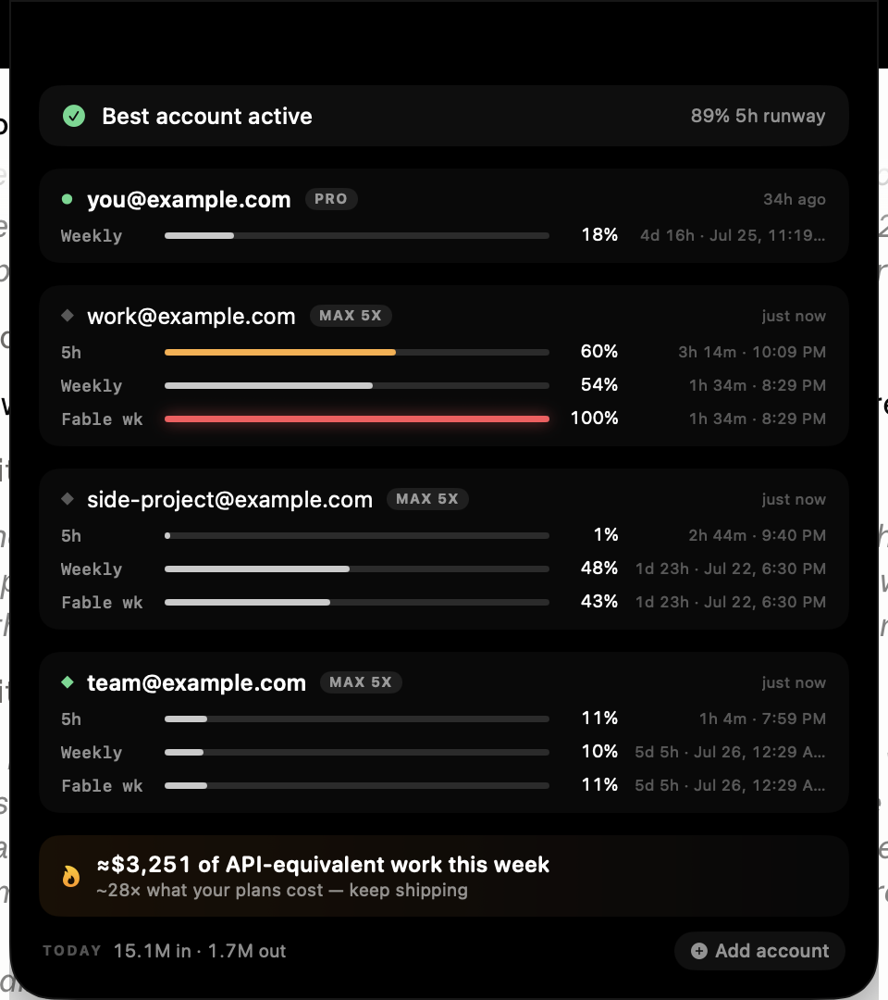
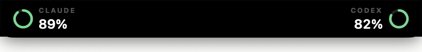

# Notch Limits

**See every Claude Code and Codex subscription's usage limits at a glance — living in your Mac's notch.**

If you pay for more than one Claude or Codex plan, you have no way to know which one has headroom left. This puts all of them in one place: 5-hour windows, weekly windows, per-model caps, reset times, and a recommendation for which account to use next.



Hover the notch and it opens. Move away and it disappears back into the hardware.

| | |
|---|---|
|  | **Ambient** — indistinguishable from the notch itself. One dim dot per provider, which brightens only when a budget crosses 85%. |
|  | **Glance** — hover, and remaining-budget chips slide out from behind the notch. |

## What it does

- **All your accounts, live.** Every Claude account you add is polled independently, so you see everyone's limits at once — not just the one you're currently signed into.
- **The limits you didn't know you had.** Claude enforces per-model weekly caps separate from your overall weekly. It's routine to sit at 50% overall while one model is at 98% and about to lock you out. Those get their own bar.
- **Reset times, not just percentages.** Every window shows a countdown *and* the wall-clock moment it resets (`2h 5m · 8:30 PM`).
- **Which account to use next.** A recommendation ranked by remaining headroom across every account.
- **One-click Codex account switching**, with automatic backups.
- **Today's token usage**, summed from local Claude Code transcripts.

## Install

Requires macOS 14+ and the [Swift toolchain](https://www.swift.org/install/macos/) (or Xcode).

```bash
git clone https://github.com/everyai-com/notch-limits.git
cd notch-limits
./build-app.sh release --install
```

That builds the app, installs it to `/Applications`, and launches it. A locally-built app is never quarantined by Gatekeeper, so there's nothing to click through.

> **Homebrew** (`brew install --cask …`) lands with the first notarized release — see [Releases](../../releases).

<details>
<summary><b>Maintainers: publishing a signed release</b></summary>

Signed, notarized DMGs need five GitHub secrets. Configure them in one pass:

```bash
./scripts/setup-signing.sh
```

It reads your Developer ID from the keychain, exports and uploads the
certificate, and prompts for your Apple ID and an app-specific password
(generate one at [appleid.apple.com](https://appleid.apple.com) → Sign-In and
Security → App-Specific Passwords). Nothing is echoed or left on disk.

| Secret | Source |
|---|---|
| `CSC_LINK` | Developer ID cert, base64 `.p12` — set by the script |
| `CSC_KEY_PASSWORD` | Password you choose during export |
| `APPLE_TEAM_ID` | Read from the certificate |
| `APPLE_ID` | Apple Developer account email |
| `APPLE_APP_SPECIFIC_PASSWORD` | appleid.apple.com |

To set one by hand instead: `gh secret set APPLE_ID` — or use the web UI at
**Settings → Secrets and variables → Actions → New repository secret**.

Then tag to publish:

```bash
git tag v0.1.0 && git push --tags
```

Without these the workflow still builds a DMG; it just isn't Gatekeeper-clean.

</details>

## Adding accounts

Hover the notch to open it, then click **⊕ Add account** in the bottom-right. (The same options live in the menu bar panel.)

**Claude** — choose a browser from the menu, sign in, and authorize. The app runs the same PKCE OAuth flow `claude login` uses and catches the redirect on `localhost:54545` — nothing to copy or paste. The account appears with its limits within seconds.

> Each browser keeps its own cookie session, which is why you pick one: sign in to account A in Safari, account B in Chrome, and nothing gets logged out. A private window works too.

**Codex** — sign in with `codex login` in a terminal, then choose **Import current CLI login**. The profile is named automatically from the account's email. Repeat per account; switch between them from the panel.

## Security & privacy

This app holds OAuth tokens for accounts you pay for, so here is exactly what it does with them:

- **Tokens are stored in `~/.ccmanager/profiles/`, mode `0600`** (owner read/write only). Nothing else on your machine can read them.
- **They are sent to exactly two places**: `api.anthropic.com` and `console.anthropic.com`, to read your usage and refresh expired tokens. That's it — see [`ClaudeProvider.swift`](Sources/CCManager/ClaudeProvider.swift) and [`ClaudeOAuth.swift`](Sources/CCManager/ClaudeOAuth.swift).
- **No telemetry, no analytics, no servers of ours.** There is no backend. Every network call in this codebase goes to an official provider endpoint.
- **The macOS Keychain is never read or written.** Not once — [grep for it](Sources/CCManager/). Your Claude CLI's own credentials are left completely alone.
- **Codex switching backs up first.** The current `~/.codex/auth.json` is copied to `~/.ccmanager/backups/` before any swap, and the write is atomic.

To see everything the app can read on your machine, without launching the UI:

```bash
/Applications/CCManager.app/Contents/MacOS/CCManager --diagnose
```

## How the data is obtained

The two providers could not be more different, and the app is honest about the gap.

**Claude** — `GET api.anthropic.com/api/oauth/usage` with each account's OAuth token, polled at most every 5 minutes. Returns `five_hour` and `seven_day` utilization plus reset timestamps, and a `limits` array carrying model-scoped caps. Because each stored account has its own token, all accounts can be polled regardless of which one the CLI is using.

**Codex** — there is no usable usage endpoint (`/backend-api/codex/usage` and `/rate_limits` both return **403**). Limits are only exposed as `x-codex-*` headers on real API responses. Fortunately the Codex CLI already logs those headers into `~/.codex/logs_2.sqlite`, so the app harvests them locally — **zero quota, zero network calls**. The catch: figures are only as fresh as your last Codex call, and Codex records them sparingly. Every reading is labelled with its age, and windows past their reset are shown as empty rather than stale.

This asymmetry is also why Codex only shows the *active* account's usage, while Claude shows all of them.

## Known limitations

- **Claude account switching isn't supported.** Changing which account the `claude` CLI uses means writing its Keychain entry, and this app deliberately never touches the Keychain. It tells you which account has headroom; you switch with `claude` yourself.
- **Codex usage is active-account only**, for the reason above.
- **Token counts are machine-wide**, not per-account — Claude Code transcripts don't record which account was active.
- **Stored Codex profiles are point-in-time snapshots.** Refresh tokens rotate; a profile left unused long enough may need a fresh `codex login` and re-import. (Claude profiles auto-refresh.)

## Building & contributing

```bash
swift build                     # debug build
./build-app.sh release          # build CCManager.app
./build-app.sh release --install # …and install to /Applications
```

To sign with your own Developer ID, set `CCM_SIGN_IDENTITY`; otherwise the build is ad-hoc signed, which is fine for local use.

```bash
export CCM_SIGN_IDENTITY="Developer ID Application: Your Name (TEAMID)"
```

Useful during development:

```bash
CCM_NOTCH_STATE=full ./CCManager.app/Contents/MacOS/CCManager   # pin the notch open
CCM_NOTCH_STATE=glance ./CCManager.app/Contents/MacOS/CCManager
```

| File | Role |
|---|---|
| `NotchController.swift` / `NotchView.swift` | The notch panel and its three states |
| `MenuView.swift` | Menu bar panel (account management) |
| `ClaudeProvider.swift` / `ClaudeOAuth.swift` | Claude tokens, login flow, usage polling |
| `CodexProvider.swift` | Codex JWT identity + sqlite header harvesting |
| `ProfileStore.swift` | Profile storage, atomic switching, backups |
| `AccountManager.swift` | Refresh loop and recommendation |

## A note on intent

This is a dashboard for subscriptions you legitimately pay for — so you can see them in one place instead of guessing. It is not a tool for evading rate limits, and please don't use it as one. Check your providers' terms before running many accounts.

## License

MIT — see [LICENSE](LICENSE).
